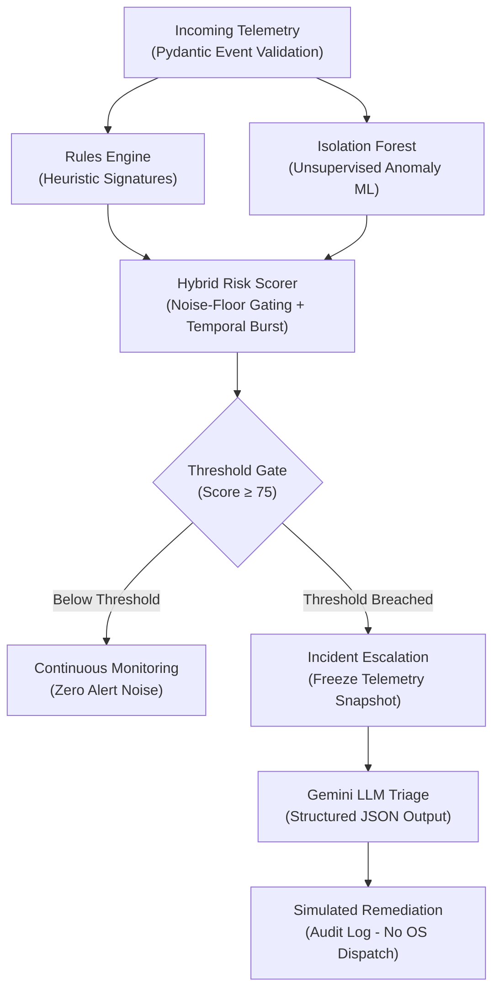

# 🛡️ AegisAI — Autonomous Cyber Defense & Triage Engine

[](https://www.python.org/downloads/)
[](https://docs.pydantic.dev/)
[](https://scikit-learn.org/)
[](https://ai.google.dev/)
[](SECURITY.md)

**AegisAI** is an AI-powered autonomous endpoint detection and incident triage system. It combines deterministic heuristic rules with unsupervised machine learning (Isolation Forest) to detect complex multi-stage attacks, scoring events into a running risk tally per entity before triggering autonomous LLM incident triage with simulated mitigation recommendations.

---

## 🏗️ Architecture & Dataflow



---

## 🎯 Evaluator Signals & Design Pillars

| Evaluator Pillar | Implementation in AegisAI |
| :--- | :--- |
| **Code Quality** | Strict Pydantic v2 schemas (`Event`, `TriageResult`), 100% type annotations, exhaustive docstrings, modular files under 100 lines. |
| **Architecture** | Cleanly decoupled separation of concerns (`rules`, `anomaly`, `scorer`, `triage`, `remediate`, `models`, `config`). |
| **Security** | Zero hardcoded secrets (`.env` + `python-dotenv`), edge schema validation, strict LLM JSON constraints, and guaranteed simulated-only containment ([`SECURITY.md`](SECURITY.md)). |
| **Innovation** | Hybrid rules + ML scoring eliminates single-method blindspots; **temporal burst correlation** (sliding-window multi-event cluster bonus) accelerates rapid-fire multi-stage threat detection without false positive overhead; active closed-loop remediation mitigation proposals rather than passive text. |

---

## 📂 Repository Structure

```text
├── src/
│   ├── __init__.py           # Package exports & versioning
│   ├── config.py             # Environment config, .env loading & named constants
│   ├── models.py             # Pydantic data contracts (Event, TriageResult, ScoreBreakdown)
│   ├── rules.py              # Point-based regex heuristics for known attack patterns
│   ├── anomaly.py            # Isolation Forest anomaly detection & feature extraction
│   ├── scorer.py             # Stateful per-user risk aggregation & threshold gating
│   ├── triage.py             # Gemini LLM triage with strict JSON schema & retry validation
│   ├── remediate.py          # Audit logging for simulated containment actions
│   └── data_generator.py     # Benign baseline & scripted attack scenario synthesizer
├── tests/
│   ├── __init__.py
│   └── test_aegis.py         # Full unit & integration test suite (8 passing tests)
├── .env.example              # Environment variables template
├── .gitignore                # Protects secrets, virtual environments, and caches
├── pytest.ini                # Pytest configuration
├── app.py                    # Interactive Streamlit dashboard
├── SECURITY.md               # Detailed security policy & MITRE ATT&CK mapping
├── TRD.md                    # Technical requirements document
├── PRD.md                    # Product requirements document
└── WORKFLOW.md               # Workflow specifications
```

---

## ⚡ Quickstart & Installation

### 1. Clone & Install Dependencies
```bash
git clone <repo-url>
cd Buildathon
pip install -r requirements.txt # or pip install pydantic scikit-learn google-genai python-dotenv streamlit pytest
```

### 2. Configure Environment Variables
Copy `.env.example` to `.env` and set your credentials:
```bash
cp .env.example .env
```
Inside `.env`:
```env
GEMINI_API_KEY=your_gemini_api_key_here
THRESHOLD=75
MODEL_NAME=gemini-2.5-flash
LOG_LEVEL=INFO
```

### 3. Run Automated Tests
```bash
python -m pytest tests/ -v
```

### 4. Launch Interactive Dashboard
```bash
streamlit run app.py
```

---

## 🔮 Scope-Cut Items (Future Work)

To maintain strict code quality, zero-stub integrity, and rock-solid architectural verification within the hackathon timeframe, the following capabilities are documented as future roadmap extensions:
1. **Graph Neural Network (GNN) Correlation**: Enterprise-scale entity relationship graphs connecting multi-host lateral movement.
2. **Live Agent SOAR Orchestration**: Active push of containment actions via authenticated EDR webhooks (after human approval gates).
3. **Automated Online Model Retraining**: Active-learning feedback loops where analyst triage decisions continuously recalibrate Isolation Forest estimators.
4. **Distributed Telemetry Ingestion Pipeline**: Apache Kafka / AWS Kinesis connector modules for multi-gigabit/sec streaming environments.