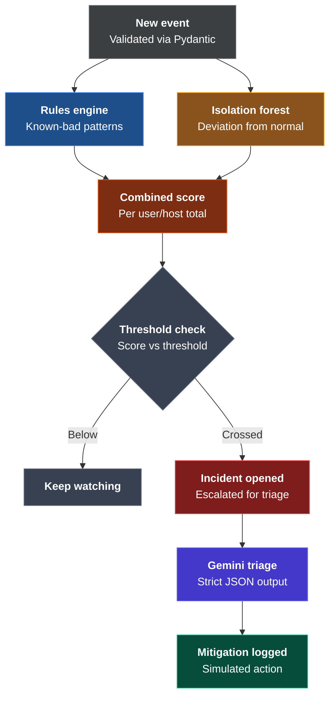

# Workflow & Architecture



```
                    New Event
              (validated via Pydantic)
                        │
          ┌─────────────┴─────────────┐
          ▼                           ▼
    Rules Engine                Isolation Forest
  (known-bad patterns,        (deviation from
   point-based)                learned normal)
          │                           │
          └─────────────┬─────────────┘
                        ▼
                 Combined Score
          (added to user/host running total)
                        ▼
                 Threshold Check
          ┌─────────────┴─────────────┐
          ▼                           ▼
      Below threshold            Crossed threshold
      → keep watching            → Incident Opened
      → no alert                         │
                                         ▼
                                  Gemini Triage
                        (strict JSON → validated
                           into TriageResult)
                                         ▼
                                Mitigation Logged
                        (simulated action, explicitly
                              labeled as simulated)
```

> **Core Architectural Rule**: Rules + isolation forest scores combine first; Gemini only explains and proposes — never executes.

---

# Implementation Plan — Phased (5hr, code-quality-first)

| Phase | Task | Time | Grader signal it targets |
|---|---|---|---|
| **0** | `.env` setup, Gemini key test call, repo skeleton | 20 min | Security (no hardcoded secrets) |
| **1** | Pydantic models (`Event`, `TriageResult`) | 20 min | Code quality |
| **2** | Mock event generator — scripted normal + 3 attack scenarios | 25 min | — |
| **3** | `rules.py`, console-tested against mock data | 30 min | Architecture |
| **4** | `anomaly.py` (IsolationForest), console-tested | 40 min | Innovation |
| **5** | `scorer.py` — combined score + threshold | 25 min | Architecture |
| **6** | `triage.py` — Gemini call, validated JSON, retry-once logic | 50 min | Innovation, Security |
| **7** | `remediate.py` — simulated mitigation logging | 20 min | Innovation, Security |
| **8** | Thin Streamlit wiring (minimal — not graded) | 30 min | — |
| **9** | `SECURITY.md`, README (architecture + scope-cut future work), commit | 40 min | Security, Architecture |

---

## Contingency & Priority Order
**If time runs out:**
- Cut Phase 8 (dashboard) before anything else — it's not graded.
- **Never cut**: Pydantic validation, docstrings, or `SECURITY.md` — those are pure grader-facing wins for near-zero time cost.
